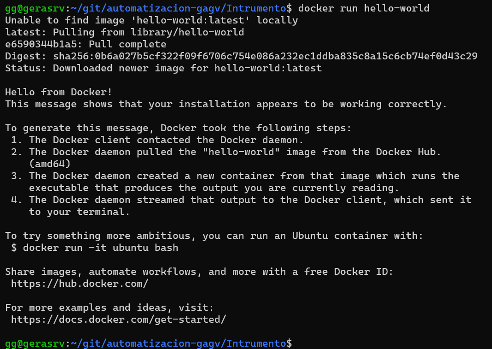
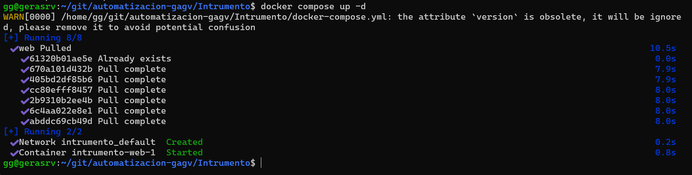
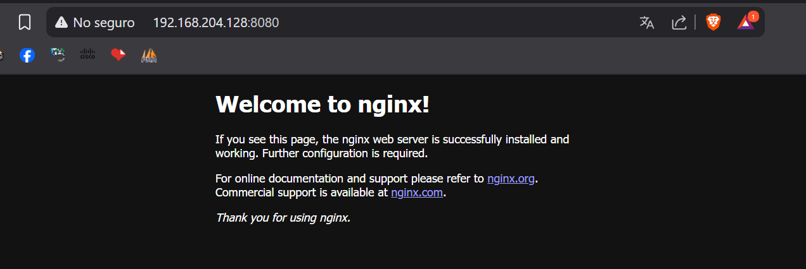

# README - Automatización de Infraestructura Digital  
## Unidad I – Entornos de desarrollo en la automatización de redes  

---

### Portada

**Institución:** Universidad Tecnologica del Norte de Guanajuato  
**Carrera:** Ingeniería en Redes Inteligentes y Ciberseguridad  
**Grupo:** GIRI9051  
**Unidad 1:** Entornos de desarrollo en
la automatización de redes  
**Nombre:** Gerardo Antonio García Vázquez   
**Núm. Control:** 1222100818  
**Fecha:** Miercoles, 11 de Junio    

---

### Introducción

La automatización de redes y servicios es un componente esencial en entornos modernos de TI. Permite configurar, desplegar, probar y gestionar infraestructura y aplicaciones con rapidez, consistencia y mínima intervención humana.  

Este documento presenta el desarrollo de un entorno de automatización utilizando herramientas de contenedores como Docker, orquestadores como Docker Compose, y herramientas de documentación de APIs como Swagger.  

Se detallan los pasos para instalar y configurar cada herramienta, comandos comunes utilizados durante el proceso, ejecución de pruebas para verificar la correcta instalación, y se incluye una sección para la inserción de evidencia visual. Este entorno es la base para implementar soluciones escalables y reproducibles en automatización de redes.

---

### Desarrollo

#### Herramientas utilizadas para automatización

#####  Docker Engine 🐳

Docker Engine es la tecnología principal para la creación y ejecución de contenedores. Estos contenedores permiten encapsular aplicaciones con todas sus dependencias, facilitando su portabilidad y despliegue.

- **Comando para verificar si Docker está instalado:**
  ```bash
  docker --version
  ```

- **Comandos comunes:**
  ```bash
  docker pull <imagen>          # Descarga una imagen desde Docker Hub
  docker run <imagen>           # Ejecuta un contenedor basado en una imagen
  docker ps                     # Lista contenedores en ejecución
  docker ps -a                  # Lista todos los contenedores
  docker stop <nombre/id>       # Detiene un contenedor
  docker rm <nombre/id>         # Elimina un contenedor
  docker images                 # Lista imágenes disponibles localmente
  docker rmi <imagen>           # Elimina una imagen
  ```

#####  Docker Compose 🧹

Docker Compose permite definir y ejecutar aplicaciones multicontenedor mediante un archivo `docker-compose.yml`.

- **Ventajas:**
  - Automatiza el despliegue de múltiples servicios.
  - Reutilización y configuración de volúmenes, redes, variables de entorno, etc.

- **Comandos básicos:**
  ```bash
  docker-compose up            # Levanta los servicios definidos en el archivo
  docker-compose up -d         # Levanta los servicios en segundo plano
  docker-compose down          # Detiene y elimina los contenedores y redes
  ```

#####  Docker Swagger (Swagger Editor) 📄

Swagger Editor permite visualizar, diseñar y documentar APIs REST usando la especificación OpenAPI.

- **Instalación rápida vía Docker:**
  ```bash
  docker pull swaggerapi/swagger-editor
  docker run -d -p 8080:8080 swaggerapi/swagger-editor
  ```

- Acceso: Navegador en `http://localhost:8080`

---

#### Procedimiento de instalación

##### 1️⃣ Instalación de herramientas necesarias

###### Visual Studio Code (VSCode)

Editor de código ligero, ideal para desarrollo de contenedores y automatización.

- Descargar desde: [https://code.visualstudio.com/](https://code.visualstudio.com/)
- Extensiones recomendadas:
  - **Docker**
  - **YAML**
  - **GitLens**
  - **Remote - Containers**
  - **REST Client**

### Git

- Instalación en Ubuntu:
  ```bash
  sudo apt update
  sudo apt install git
  ```

- Comandos esenciales:
  ```bash
  git init
  git clone <url>
  git add .
  git commit -m "mensaje"
  git push origin main
  git pull
  ```

### 2️⃣ Instalación de Docker

```bash
sudo apt-get update
sudo apt-get install \
    ca-certificates \
    curl \
    gnupg
sudo install -m 0755 -d /etc/apt/keyrings
curl -fsSL https://download.docker.com/linux/ubuntu/gpg | sudo gpg --dearmor -o /etc/apt/keyrings/docker.gpg
echo \
  "deb [arch=$(dpkg --print-architecture) signed-by=/etc/apt/keyrings/docker.gpg] \
  https://download.docker.com/linux/ubuntu \
  $(lsb_release -cs) stable" | sudo tee /etc/apt/sources.list.d/docker.list > /dev/null
sudo apt-get update
sudo apt-get install docker-ce docker-ce-cli containerd.io
```

- **Verificar estado:**
  ```bash
  systemctl status docker
  ```

### 3️⃣ Instalación de Docker Compose

```bash
sudo apt install docker-compose
docker-compose --version
```

### 4️⃣ Instalación de Swagger Editor (Docker)

```bash
docker pull swaggerapi/swagger-editor
docker run -d -p 8080:8080 swaggerapi/swagger-editor
```

Acceso en navegador: `http://localhost:8080`

---

### Evidencia de pruebas de verificación

#### ✅ Prueba 1: Ejecutar imagen `hello-world`

```bash
docker run hello-world
```

Resultado esperado: mensaje de confirmación de instalación correcta.

**Resultado - Evidencia Hello World:**

<p align="center">
  
</p>

#### ✅ Prueba 2: Ejecutar archivo `docker-compose.yml`

Archivo:
```yaml
version: '3'
services:
  web:
    image: nginx
    ports:
      - "8080:80"
```

Ejecución:
```bash
docker-compose up -d
```
**Resultado - Docker Compose:**
<p align="center">
  
</p>

Verificación: Acceder a `http://localhost:8080` para ver la página de Nginx.

**Resultado - Docker Funcionando:**
<p align="center">
  
</p>

---


### Recursos utilizados de la comunidad

- [Docker Documentation](https://docs.docker.com/)
- [Docker Hub](https://hub.docker.com/)
- [GitHub Swagger Editor](https://github.com/swagger-api/swagger-editor)
- [Stack Overflow](https://stackoverflow.com/)
- Foros técnicos en Reddit y Discord
- Repositorios de GitHub sobre DevOps

---

### Conclusión

El entorno de automatización de redes fue implementado exitosamente utilizando herramientas como Docker, Docker Compose y Swagger. Se configuró el entorno con VSCode, Git y contenedores funcionales. Las pruebas realizadas muestran que el entorno está listo para operaciones más avanzadas. Este trabajo establece una base sólida para el desarrollo continuo de infraestructura automatizada.

---

### Bibliografía

Bell, P. (2025). *Introducing GitHub: A Non-technical Guide*. O'Reilly Media.  
Gift, N., Schott, J., Kennedy, T., & Osowski, B. (2019). *Python for DevOps*. O'Reilly Media.  
Hillar, G. C. (2016). *Building RESTful Python Web Services*. Packt Publishing.  
Jackson, C., Wallace, J., & Blair, J. (2020). *Cisco Certified DevNet Associate*. Cisco Press.  
Lenz, M. (2018). *Python Continuous Integration and Delivery*. Apress.  
Tsitoara, M. (2019). *Beginning Git and GitHub*. Apress.  
